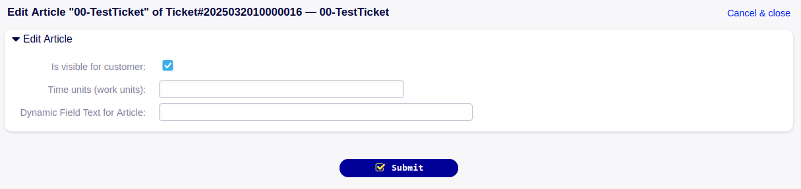
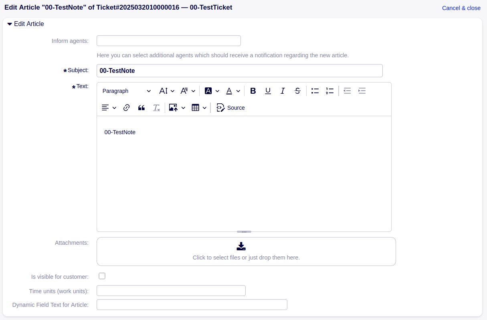

.. toctree::
    :maxdepth: 2
    :caption: Contents

Sacrifice to Sphinx
===================

Description
===========
The package ExtendedArticleEdit allows editing of article dynamic fields, customer visibility and time accounting for all article types, including e-mails, as well as editing subject, body and attachments for internal and phone articles.

System requirements
===================

Framework
---------
OTOBO 11.0.x

Packages
--------
\-

Third-party software
--------------------
\-

Usage
=====
Editing of subject, body and attachments in general is already possible for internal notes. With this package, editing can be enabled for phone and email articles as well, alongside with editing further article attributes like customer visibility state, adding time units and editing article dynamic field values.

Editing subject, body and attachments can be en- or disabled for internal and phone articles and is in general not possible for e-mail articles.

Editing an article without having enabled editing subject, body and attachments may look like figure 3.1.

   The screenshot shows an article edit screen without subject, body and attachments.

Editing an article for which editing of subject, body and attachments is enabled may look like figure 3.2.

   The screenshot shows an article edit screen with subject, body and attachments.

Note that time units are added instead of being overwritten.

Setup
-----
General editing is enabled for all articles which are not visible to the customer by default. Whether articles visible to the customer can be edited, is controlled by the system configuration setting **Ticket::Frontend::AgentTicketArticleEdit###ArticleCustomerVisible**.

Editing the article subject, body and attachments is in general only possible for internal and phone articles and per default only enabled for internal articles. This is controlled by the system configuration setting **Ticket::Frontend::AgentTicketArticleEdit###Article**.

Time units and the customer visibility state of articles are not displayed per default in the article edit screen. This can be enabled via the system configuration settings **Ticket::Frontend::AgentTicketArticleEdit###TimeUnits** and **Ticket::Frontend::AgentTicketArticleEdit###IsVisibleForCustomer**.

Configuration Reference
-----------------------

Frontend::Agent::View::TicketArticleEdit
^^^^^^^^^^^^^^^^^^^^^^^^^^^^^^^^^^^^^^^^^^^^^^^^^^^^^^^^^^^^^^^^^^^^^^^^^^^^^^^^^^^^^^^^^^^^^^^^^^^^^^^^^^^^^^^^^^^^^^^^^^^^^^

Ticket::Frontend::AgentTicketArticleEdit###IsVisibleForCustomer
""""""""""""""""""""""""""""""""""""""""""""""""""""""""""""""""""""""""""""""""""""""""""""""""""""""""""""""""""""""""""""""
Adds customer visibility of the article to the article edit screen of the agent interface.

Ticket::Frontend::AgentTicketArticleEdit###TimeUnits
""""""""""""""""""""""""""""""""""""""""""""""""""""""""""""""""""""""""""""""""""""""""""""""""""""""""""""""""""""""""""""""
Sets the time units in the ticket note screen of the agent interface.

Ticket::Frontend::AgentTicketArticleEdit###Article
""""""""""""""""""""""""""""""""""""""""""""""""""""""""""""""""""""""""""""""""""""""""""""""""""""""""""""""""""""""""""""""
Defines for which article types the editing of subject, body and attachment is enabled. "Both" includes "Phone" and "Internal".

Ticket::Frontend::AgentTicketArticleEdit###ArticleCustomerVisible
""""""""""""""""""""""""""""""""""""""""""""""""""""""""""""""""""""""""""""""""""""""""""""""""""""""""""""""""""""""""""""""
Enables or disables the editing of articles which are visible for the customer in general.

Frontend::Agent::View::TicketZoom::ArticleAction
^^^^^^^^^^^^^^^^^^^^^^^^^^^^^^^^^^^^^^^^^^^^^^^^^^^^^^^^^^^^^^^^^^^^^^^^^^^^^^^^^^^^^^^^^^^^^^^^^^^^^^^^^^^^^^^^^^^^^^^^^^^^^^

Ticket::Frontend::Article::Actions###Phone
""""""""""""""""""""""""""""""""""""""""""""""""""""""""""""""""""""""""""""""""""""""""""""""""""""""""""""""""""""""""""""""
Defines available article actions for Phone articles.

Ticket::Frontend::Article::Actions###Email
""""""""""""""""""""""""""""""""""""""""""""""""""""""""""""""""""""""""""""""""""""""""""""""""""""""""""""""""""""""""""""""
Defines available article actions for Email articles.

About
=======

Contact
-------
| Rother OSS GmbH
| Email: hello@otobo.io
| Web: https://otobo.io

Version
-------
Author: |doc-vendor| / Version: |doc-version| / Date of release: |doc-datestamp|
